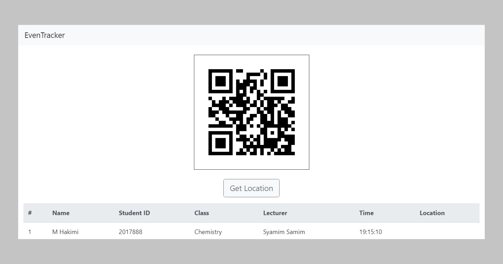

# Event-Trackers
Track your attendance in any event. [Look around!](https://eventrackers.pythonanywhere.com) _Client-Side app incomplete_
API Endpoint https://eventrackers.pythonanywhere.com/--api/

## Table of Contents
* [General Info](#general-information)
* [Technologies Used](#technologies-used)
* [Project Status](#project-status)
* [Screenshots](#screenshots)
* [Contact](#contact)

## General Information
- This project use QR code (created randomly) to register you into certain events.
- No longer you should you write your name to prove your attendance when you participate in events.

## Technologies Used
- Django + Library (QRcode)
- Front-end framework (Bootstrap, jQuery, AJAX)

## Project Status
Project is: _in progress_. Backend part of the website is mostly done. For now, I only set it up to register a student into a class when scanned not some other categories. It already provide functions to generate QR code and logging people in. I planned to use Android as the client that consume the Rest API. Android skeleton project of student version has completed but it is completely hideous. Need some more work.

## Screenshots

## Contact
Created by [@kimi_hmzn](https://twitter.com/HakimiHamzan) - no I am not on social media much
